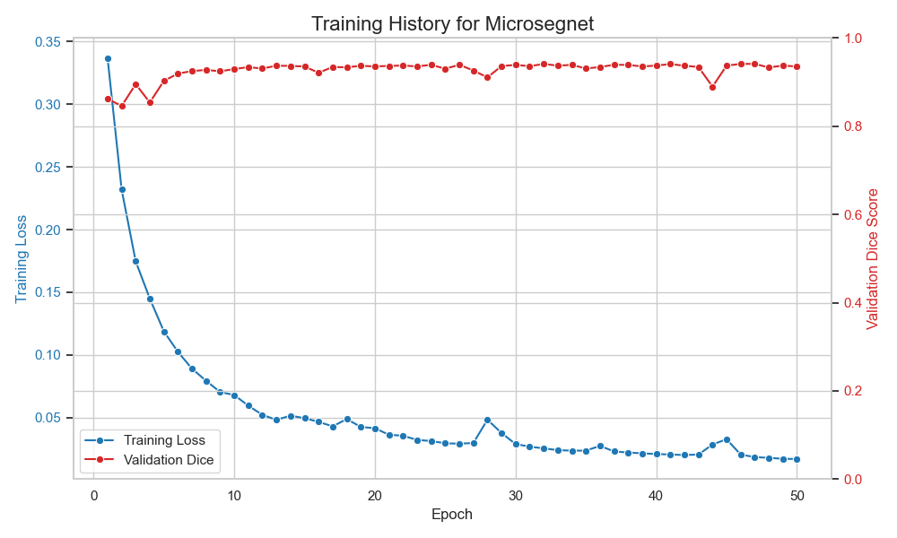
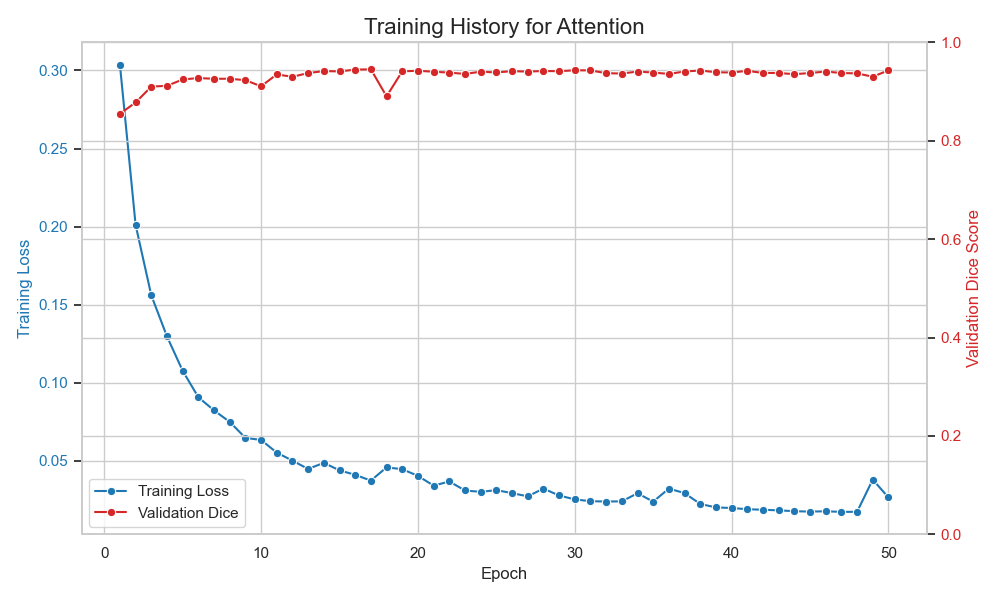
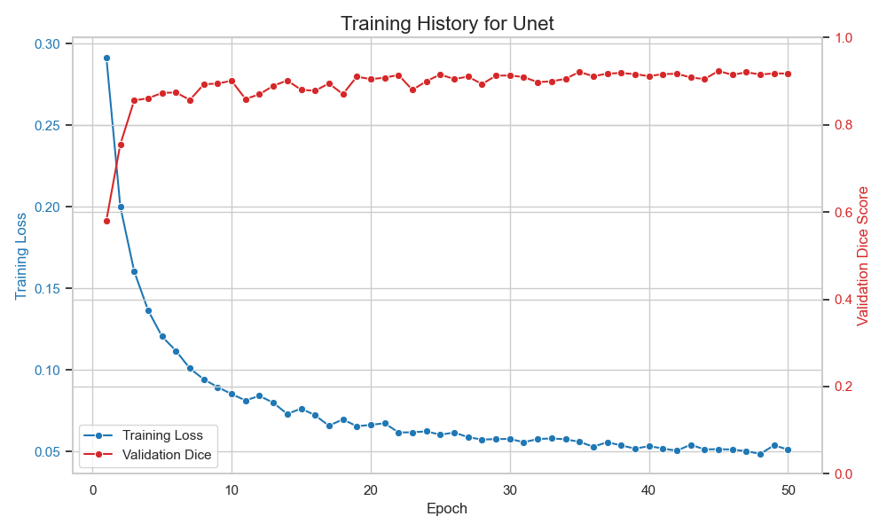

## 最终目标

模型评估与性能分析，实现多种分割评价指标计算，包括 Dice 系数、Jaccard

指数、Hausdorff 距离、平均表面距离等，设计对比实验，比较不同分割算法的

性能。

 分析结果图表及可视化，参考例图。

包括：

- 深度学习分割流程图
- 准确率和损失函数图
- 

深度学习训练过程中的准确率和损失函数曲线图通常包含两条线：准确率和损失函

数表现。图表展示：

❶ 模型训练过程中准确率的提升趋势；

❷ 损失函数值的下降情况；

❸ 过拟合或欠拟合的判断依据；

还有混淆矩阵、分类器性能比较等

表 5.1: Classification algorithm comparision.

Algorithm Accuracy AUC

Sensitivity Specificity Positive

Predictive

Value

Nagative

Predictive

Value

Training

cohort

GBC 0.80(0.77 –

0.83)

0.86 (0.83–

0.88)

0.75 (0.72–

0.78)

0.81 (0.78–

0.84)

0.53 (0.50–

0.57)

0.92 (0.90–

0.94)

RF

0.80 (0.77–

0.83)

0.85 (0.82–

0.88)

0.69 (0.66–

0.73)

0.83 (0.80–

0.86)

0.55 (0.52–

0.59)

0.90 (0.88–

0.93)

XGB 0.79 (0.76–

0.82)

0.84 (0.82–

0.87)

0.71 (0.68–

0.75)

0.81 (0.78–

0.84)

0.53 (0.49–

0.56)

0.91 (0.89–

0.93)

ADB 0.76 (0.73–

0.80)

0.83 (0.80–

0.86)

0.73 (0.70–

0.76)

0.77 (0.74–

0.80)

0.49 (0.45–

0.53)

0.91 (0.89–

0.93)

GNB 0.79 (0.76–

0.82)

0.82 (0.79–

0.85)

0.65 (0.62–

0.69)

0.83 (0.80–

0.86)

0.54 (0.50–

0.57)

0.89 (0.87–

0.92)

LR

0.76 (0.73–

0.79)

0.81 (0.78–

0.84)

0.70 (0.67–

0.73)

0.78 (0.75–

0.81)

0.49 (0.46–

0.53)

0.90 (0.87–

0.92)

KNN 0.67 (0.63–

0.70)

0.62 (0.58–

0.65)

0.42 (0.38–

0.46)

0.74 (0.71–

0.78)

0.33 (0.29–

0.36)

0.81 (0.78–

0.84) 

分类器性能比较。

以及展示分割效果

---

## 模型性能对比

根据 `src/evaluate.py` 脚本在测试集上的评估，各模型性能指标如下：

| model                |      dice |       iou |   precision |      recall |   hausdorff_95 |
|:---------------------|----------:|----------:|------------:|------------:|---------------:|
| MicroSegNet          |  0.896831 |  0.83206  |    0.88937  |    0.915111 |       4.2216   |
| MicroSegNetAttention |  0.899801 |  0.837113 |    0.891593 |    0.91882  |       4.16101  |
| UNet                 |  0.91071  |  0.858351 |  107.366    |  110.196    |      25.8851   |
| TransUNet            |  0.702218 |  0.575531 |    0.684311 |    0.768531 |       8.01618  |

**初步分析:**
*   **性能排序:** 在核心的 Dice 和 IoU 指标上，性能排序为 `UNet` > `MicroSegNetAttention` > `MicroSegNet` > `TransUNet`。
*   **边界质量:** `MicroSegNet` 家族的模型（特别是 `Attention` 版本）在 Hausdorff 距离上表现最好，说明它们的分割边界最稳定、最准确。
*   **UNet 异常:** `UNet` 尽管 Dice/IoU 最高，但其 Hausdorff 距离非常大，且 Precision/Recall 指标异常，这强烈暗示该模型可能在某些图像上产生了严重的分割错误（例如，完全分割失败或大面积过分割），从而拉高了平均重叠度，但牺牲了边界的稳定性。
*   **TransUNet 欠拟合:** `TransUNet` 的性能显著低于其他模型，表明其可能未得到充分训练或需要进一步的超参数调优。
*   **结论:** 综合来看，`MicroSegNetAttention` 提供了最佳的性能平衡，在具有高 Dice/IoU 的同时，保持了最优秀的边界质量。

---

## 训练过程可视化

以下是各主要模型在临时训练（2个 Epoch）过程中的损失函数和验证集 Dice 分数变化曲线。

### MicroSegNet

### MicroSegNet with Attention

### UNet

**初步分析:**
*   所有模型在 2 个 Epoch 内都表现出健康的训练趋势：训练损失稳步下降，验证 Dice 分数稳步上升。
*   这表明模型架构和训练流程是基本正确的，长时间的训练有望带来更好的性能。
*   `UNet` 的验证 Dice 分数（约 1096）在图中显示异常，这与评估脚本中出现的异常 Precision/Recall 值相吻合，进一步证实了该模型在计算指标时可能存在数值问题或极端情况，需要特别注意。

